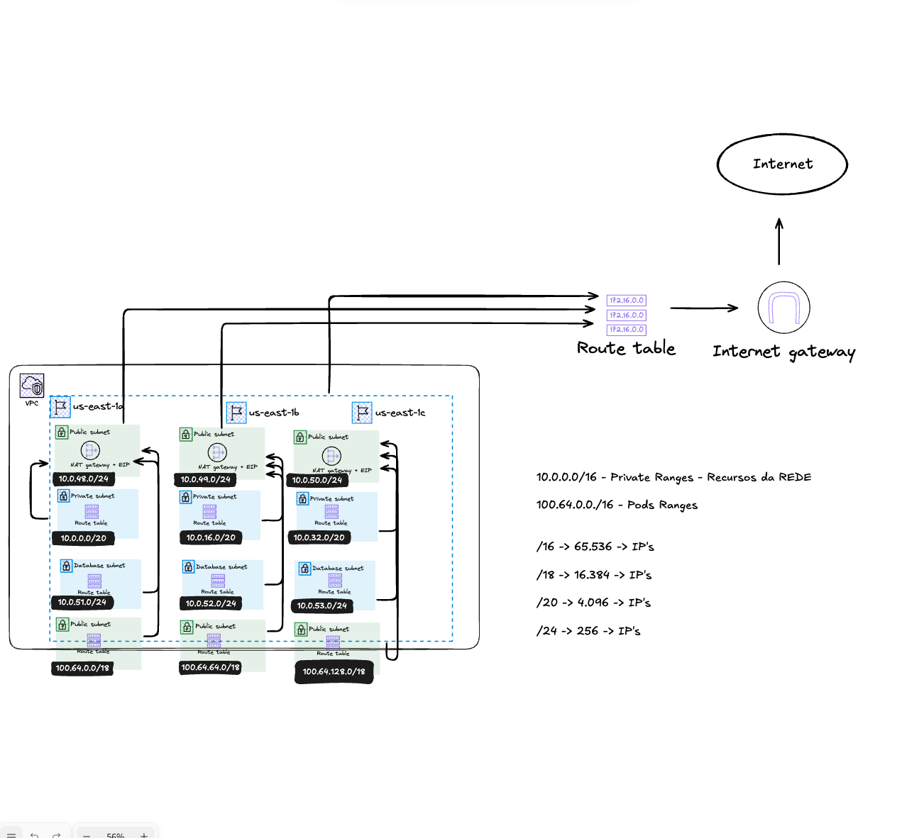

# EKS Infrastructure — Terraform

Infraestrutura de rede base para um cluster EKS na AWS, provisionada via Terraform. Este módulo cria a VPC, subnets, internet gateway, NAT gateways e tabelas de roteamento necessárias para suportar workloads Kubernetes.

---

## Estrutura de Pastas

```
EKS/
├── enviroment/
│   └── prod/
│       ├── backend.tfvars     # Configurações do backend S3 (bucket/key) — não versionar com valores reais
│       └── terraform.tfvars   # Valores das variáveis por ambiente
└── modules/
    ├── backend.tf             # Configuração do backend remoto (S3 + state locking)
    ├── igw.tf                 # Internet Gateway
    ├── output.tf              # Outputs dos recursos criados
    ├── providers.tf           # Provider AWS
    ├── variables.tf           # Declaração de variáveis
    └── vpc.tf                 # VPC, subnets, route tables, NAT gateways
```

A separação entre `modules/` (recursos) e `enviroment/` (valores por ambiente) permite reutilizar o mesmo módulo para múltiplos ambientes (prod, staging, dev) apenas trocando os `.tfvars`.

---

## Decisões de Rede

### VPC Principal — RFC 1918

O bloco CIDR principal da VPC segue o padrão **RFC 1918** de endereçamento privado, que define os ranges reservados para redes internas:

| Range | Tamanho |
|-------|---------|
| `10.0.0.0/8` | ~16 milhões de IPs |
| `172.16.0.0/12` | ~1 milhão de IPs |
| `192.168.0.0/16` | ~65 mil IPs |

Este projeto utiliza `10.0.0.0/16`, oferecendo **65.536 endereços** — suficiente para os workloads previstos com espaço para crescimento.

> Referência: [AWS VPC CIDR Blocks](https://docs.aws.amazon.com/vpc/latest/userguide/vpc-cidr-blocks.html)

---

### CIDR Adicional para Pods — RFC 6598

O EKS com **AWS VPC CNI** aloca IPs diretamente da VPC para cada pod. Em clusters maiores, isso pode esgotar rapidamente o range RFC 1918 disponível.

Para resolver isso, é associado um **CIDR adicional** usando o range **RFC 6598** (`100.64.0.0/10`), conhecido como *Carrier Grade NAT*. Esse range não é roteável na internet pública e é suportado pela AWS como CIDR secundário de VPC.

```hcl
vpc_additional_cidrs = ["100.64.0.0/16"]
```

As subnets de pods (`public_pods`) são provisionadas dentro desse range secundário, preservando os IPs RFC 1918 para outros recursos (EC2, RDS, etc).

> Referência: [EKS Networking Best Practices — AWS](https://docs.aws.amazon.com/eks/latest/best-practices/networking.html)

---

### Diagrama de Arquitetura



---

### Distribuição de Subnets

Todas as subnets são distribuídas em **3 Availability Zones** (`us-east-1a`, `us-east-1b`, `us-east-1c`) para garantir alta disponibilidade.

| Tipo | CIDR | Uso |
|------|------|-----|
| Pública | `10.0.48.0/24`, `10.0.49.0/24`, `10.0.50.0/24` | Load balancers, recursos com acesso público |
| Privada | `10.0.0.0/20`, `10.0.16.0/20`, `10.0.32.0/20` | Nodes do EKS, workloads internos |
| Database | `10.0.51.0/24`, `10.0.52.0/24`, `10.0.53.0/24` | RDS, ElastiCache |
| Public Pods | `100.64.0.0/18`, `100.64.64.0/18`, `100.64.128.0/18` | Pods EKS (CIDR secundário RFC 6598) |

As subnets privadas utilizam blocos `/20` (~4.096 IPs cada) porque concentram os nodes e pods do EKS, que consomem mais endereços. As demais usam `/24` (~256 IPs), suficiente para seus casos de uso.

---

### Roteamento

| Subnet | Saída | Via |
|--------|-------|-----|
| Pública | Internet | Internet Gateway |
| Privada | Internet | Internet Gateway |
| Database | Sem saída direta | — |
| Priv Pods | — | Associada conforme necessidade |

Os **NAT Gateways** são criados (um por AZ) para uso futuro, permitindo que recursos privados acessem a internet sem exposição direta, sem necessidade de recriar a infraestrutura.

---

## Backend Remoto — S3

O estado do Terraform é armazenado remotamente em um **bucket S3**, permitindo colaboração entre times e evitando conflitos de estado local.

### State Locking sem DynamoDB

Em vez de usar uma tabela DynamoDB para evitar execuções simultâneas, este projeto utiliza o **S3 native locking** via:

```hcl
use_lockfile = true
```

Isso cria um arquivo `.tflock` diretamente no bucket S3, eliminando a necessidade de provisionar e manter uma tabela DynamoDB separada.

> Referência: [Terraform AWS Provider Best Practices — AWS](https://docs.aws.amazon.com/pt_br/prescriptive-guidance/latest/terraform-aws-provider-best-practices/backend.html)

### Por que bucket e key estão vazios?

```hcl
# backend.tfvars
bucket = ""   # preencher com o nome do seu bucket
key    = ""   # preencher com o caminho do state file
region = "us-east-1"
```

Os valores são intencionalmente deixados em branco para:

1. **Reutilização** — o mesmo código serve para múltiplos ambientes, cada um com seu próprio bucket/key
2. **Segurança** — evitar que nomes de buckets e caminhos de estado sejam versionados no repositório

---

## Como Usar

### Pré-requisitos

- [Terraform](https://developer.hashicorp.com/terraform/install) >= 1.6
- AWS CLI configurado (`aws configure`)
- Bucket S3 criado para armazenar o state

### 1. Preencher o backend

Edite `enviroment/prod/backend.tfvars` com os dados do seu bucket S3:

```hcl
bucket = "meu-bucket-terraform"
key    = "prod/vpc/terraform.tfstate"
region = "us-east-1"
```

### 2. Preencher as variáveis

Edite `enviroment/prod/terraform.tfvars` conforme necessário:

```hcl
project_name = "meu-projeto"
region       = "us-east-1"
```

### 3. Inicializar

```bash
terraform -chdir=modules init -backend-config=../enviroment/prod/backend.tfvars
```

### 4. Planejar

```bash
terraform -chdir=modules plan -var-file=../enviroment/prod/terraform.tfvars
```

### 5. Aplicar

```bash
terraform -chdir=modules apply -var-file=../enviroment/prod/terraform.tfvars
```

### 6. Destruir (quando necessário)

```bash
terraform -chdir=modules destroy -var-file=../enviroment/prod/terraform.tfvars
```

---

## Segurança e Boas Práticas

- **Nunca versionar** `terraform.tfstate` ou `terraform.tfstate.backup` — contêm toda a infraestrutura em plaintext
- **Nunca versionar** `backend.tfvars` com valores reais preenchidos
- Segredos como senhas de banco de dados devem ser armazenados no **AWS Secrets Manager**, não em variáveis Terraform
- O diretório `.terraform/` é gerado localmente e não deve ser versionado

---

## Outputs Disponíveis

| Output | Descrição |
|--------|-----------|
| `main` | ID da VPC principal |
| `public` | IDs das subnets públicas |
| `private` | IDs das subnets privadas |
| `database` | IDs das subnets de banco de dados |
| `public-pods` | IDs das subnets de pods |
| `igw` | ID do Internet Gateway |
| `public_internet_access` | ID da route table pública |
| `eip` | IDs dos Elastic IPs dos NAT Gateways |
